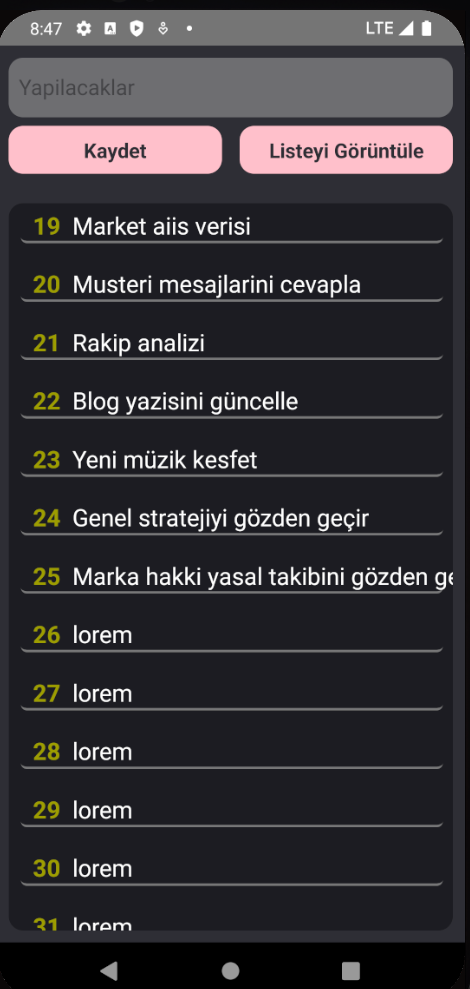

$readmeContent = @"
# Async Notes 📱
A simple **React Native application** that lets you add text via keyboard input, display it in a list, and persist the data on the device.

## 🚀 Features
- Accepts text input from the user.
- Displays the entered data in a list on the screen.
- Stores data persistently using **AsyncStorage** (data remains even after closing the app).
- Clean single-page UI.
- Modular code structure with custom components (e.g., TextBox, ButtonBox).

## 🛠️ Technologies Used
- React Native
- AsyncStorage (@react-native-async-storage/async-storage)
- Custom Components
- Simple UI design with StyleSheet

**Language: Türkçe**
# Async Notes
Klavye ile veri ekleyip listeleyen ve verileri cihazda kalıcı olarak saklayan basit bir React Native uygulaması

## Özellikler
- Kullanıcıdan metin girişi alır.
- Girilen verileri liste halinde ekrana yansıtır.
- **AsyncStorage** kullanarak verileri kalıcı olarak saklar (uygulama kapansa bile kayıtlı kalır).
- Temiz bir tek sayfa arayüz.
- Custom component yapısı ile modüler kod düzeni.

## Screenshots

"@

Set-Content -Path README.md -Value $readmeContent
